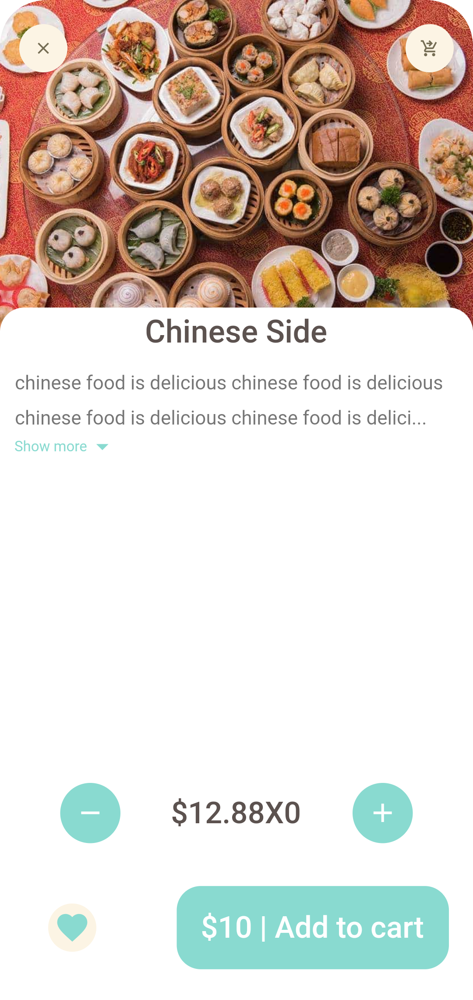

# food delivery app using flutter

This is a Food Delivery app create by using Flutter for the frontend part.

Learn from the tutorial [dbestech youtube](https://www.youtube.com/watch?v=7dAt-JMSCVQ) Flutter E-commerce App With Backend | Food Delivery App

more information [click here](https://www.dbestech.com/tutorials/flutter-food-delivery-app-e-commerce-for-ios-and-android)

